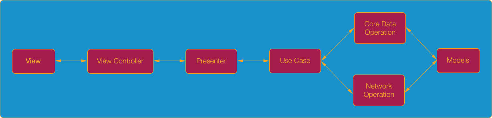

### High Level Layers

#### MVP Concepts

##### Presentation Logic
* `View` - delegates user interaction events to the `Presenter` and displays data passed by the `Presenter`
	* All `UIViewController`, `UIView`, `UITableViewCell` subclasses belong to the `View` layer
	* Usually the view is passive / dumb - it shouldn't contain any complex logic
	* Do not write UI in code. Write as less code as possible
* `Presenter` - contains the presentation logic and tells the `View` what to present
	* Usually we have one `Presenter` per scene (view controller)
	* It doesn't reference the concrete type of the `View`, but rather it references the `View` protocol that is implemented usually by a `UIViewController` subclass
	* It should be a plain `Swift` class and not reference any `iOS` framework classes - this makes it easier to reuse
	* Provides to `View` only ?`Displayable`? models
* `Router` - contains navigation / flow logic from one scene (view controller) to another
	* It's an extension for the scene (view controller)
	* Navigation is carried out through the `UIStoryboardSegue`
	* Each router must contain a segue identifier
	* Responsible for data injection due to the `func prepare(for segue: UIStoryboardSegue, sender: Any?)` method

#### Clean Architecture Concepts

##### Core Logic

* `UseCase` - contains the application / business logic for a specific use case in your application
	* It is referenced by the `Presenter`. The `Presenter` can reference multiple `UseCases` since it's common to have multiple use cases on the same screen
	* It manipulates `Entities` and communicates through `Operations` to retrieve / persist the entities

* `Entity` - plain `Swift` classes / structs
	* Models objects used by your application

##### Architecture Workflow:

[draw.io](https://drive.google.com/file/d/1gA7Ati_GojIaA910g-YRKOkbVo0PizcZ/view?usp=sharing)

#### Useful Resources
* [The Clean Architecture, by Uncle Bob](https://8thlight.com/blog/uncle-bob/2012/08/13/the-clean-architecture.html)
* [Architecture: The Lost Years, by Uncle Bob](https://www.youtube.com/watch?v=HhNIttd87xs)
* [Clean Architecture, By Uncle Bob](https://8thlight.com/blog/uncle-bob/2011/11/22/Clean-Architecture.html)
* [Uncle Bob's clean architecture - An entity/model class for each layer?](http://softwareengineering.stackexchange.com/questions/303478/uncle-bobs-clean-architecture-an-entity-model-class-for-each-layer)
