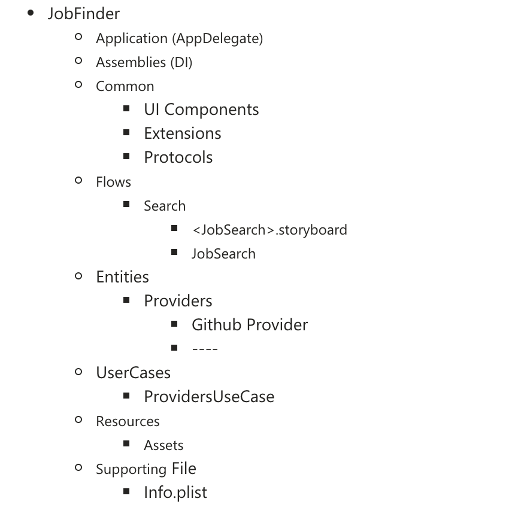
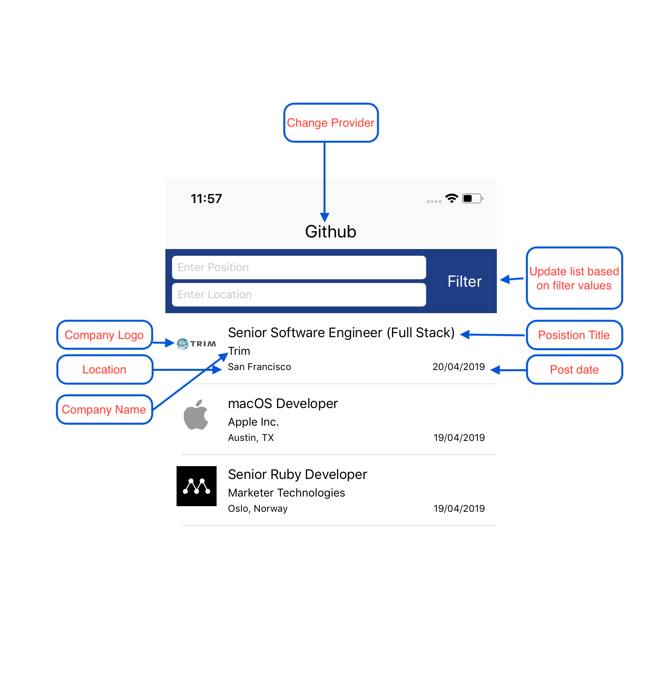

### High Level Layers

#### MVP Concepts

##### Presentation Logic
* `View` - delegates user interaction events to the `Presenter` and displays data passed by the `Presenter`
	* All `UIViewController`, `UIView`, `UITableViewCell` subclasses belong to the `View` layer
	* Usually the view is passive / dumb - it shouldn't contain any complex logic
	* Do not write UI in code. Write as less code as possible
* `Presenter` - contains the presentation logic and tells the `View` what to present
	* Usually we have one `Presenter` per scene (view controller)
	* It doesn't reference the concrete type of the `View`, but rather it references the `View` protocol that is implemented usually by a `UIViewController` subclass
	* It should be a plain `Swift` class and not reference any `iOS` framework classes - this makes it easier to reuse
* `Assembly` - to Injecting a view controller from a storyboard
	* Used to instantiate View controllers using a generic func
	* Used to inject the params for example Presenter
	* Usually we have to create extension for each module 

* `UseCase` - contains the application / business logic for a specific use case in your application
    * It is referenced by the `Presenter`. The `Presenter` can reference multiple `UseCases` since it's common to have multiple use cases on the same screen
    * It manipulates `Entities` and communicates through `Operations` to retrieve / persist the entities

* `Entity` - plain `Swift` classes / structs
    * Enterprise wide business architecture

###  Project Structure
*  This Structure was build to handle a significant expansion
*  Enterprise wide and specific business were handled

###  Project Mock:

###  Adding a New Provider:

* Go to 'Providers' folder inside 'Entities' folder and add a new object provider based on  JSON  provider Structure
* Then go to ProvidersUseCase class 
    * Add a new case in 'JobsProviders' Enum
    * Put the providerLink as is like a provider Documentation
    * Create map provider func and connect it from main map func
    * Run :)

* No need to do anything inside your Flow :)

### Autocomplete in Filter By position and Location

* There's two plist files (position.plist, location.plist) and the fetching will be based on them
* There's no enough data there, we can fill them by any API in the future

####  Resources
* [The Clean Architecture, by Uncle Bob](https://8thlight.com/blog/uncle-bob/2012/08/13/the-clean-architecture.html)
* [Architecture: The Lost Years, by Uncle Bob](https://www.youtube.com/watch?v=HhNIttd87xs)
* [Clean Architecture, By Uncle Bob](https://8thlight.com/blog/uncle-bob/2011/11/22/Clean-Architecture.html)
* [Uncle Bob's clean architecture - An entity/model class for each layer?](http://softwareengineering.stackexchange.com/questions/303478/uncle-bobs-clean-architecture-an-entity-model-class-for-each-layer)
